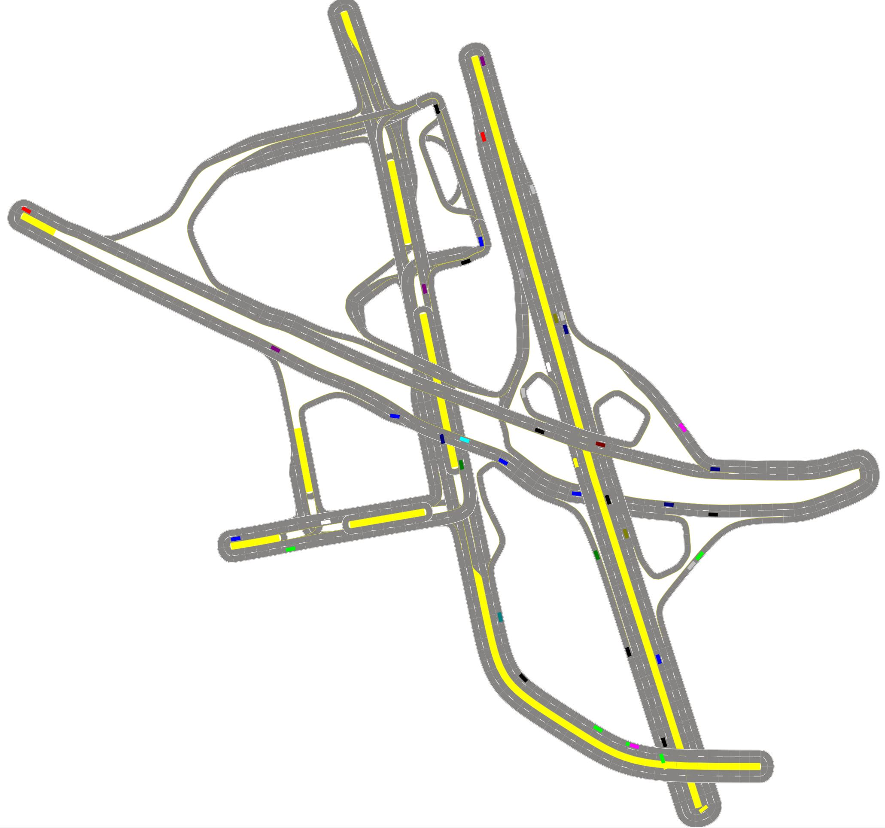

# RoadRunner Release Repository
Latest release: v0.5 on Jul 28, 2024

## About
A desktop road network editor that makes [ASAM OpenDRIVE](https://www.asam.net/standards/detail/opendrive/)-format maps. Compared to commercial mapping software, RoadRunner is intended for casual users and hobbiests, providing free and easy experience without learning curve or $$ investment.

This repository hosts RoadRunner's public releases. The source code remains private while more features are still being brought in.

## Quick Manual
### Menu
- File
  - New: Reset the application to blank state. All unsaved changes will be lost.
  - Open: Load an .xodr map. Only those exported from RoadRunner are supported.
  - Save: Save current map in .xodr format.
  - Preference: Application-wide options and About.
- Edit
  - Undo
  - Redo
  - Verify Now: Checks app state and reports any inconsistency, i.e. bug. If "Always Verify" is set to ON inside Preference, this check will run upon each edit. 
  - Toggle Simulation: Randomly spawns running cars. Used for routing graph verification only; not a traffic simulation. 
- Replay
  - Save: Save actions since startup or last New map to a .dat file. Won't work if actions contain opening an .xodr map (this is a planned feature).
  - Debug: Load saved actions (.dat) and start playing at highest rate.
  - Watch: Load saved actions (.dat). In the new dialog, hit play `>` button to play/pause, `1` to step, and `|<` to start over. Double click on a list entry to toggle break point. Playback will be in real-time, i.e. will last (roughly) how long it took to record.

### Modes
Modes are best demonstrated in [demo videos](#demo) below.
- Road mode: Create roads with auto-generated transitions and junctions.
- Lane (Manual junction) mode: Manually make junctions and highway ramps.
- Modify mode: Two clicks on the same road, then apply a new profile to the selected segment. Double-click to select entire length.
- Destroy mode: Two clicks on the same road, then destroy this segment. Double-click to destroy entire length.
- Drag (view) mode: Drag to pan. Allows traffic simulation.

### Keys
- Ctrl: hold + mouse scroll to zoom.
- Enter: Confirm road edits.
- Escape: Cancel road edits.
- Key_I: Print (to the console) more details of the hovering road.
- Key_A: Cycle to the next overlapping road, where multiple roads overlap.

## Demo
Click on images to check out the **video**.

Please check out [Quick manual](#menu) for how to use the attachment below.
- [OpenDRIVE map](resources/basics.xodr)
- [Action Replay](resources/basics.dat)

- [OpenDRIVE map](resources/hwy_exit.xodr)
- [Action Replay](resources/hwy_exit.dat)

### Bedford interchange

[OpenDRIVE map](resources/bedford.xodr)

## Known issues
- Action replay may sometimes not work properly cross-platform, or on monitors with big resolution difference.

- Occasional bugs in routing graph conversion and traffic simulation.

If you find anything bothering or can't get around with, reporting is welcome through Github issues. Please attach the .xodr map and .dat action record if possible.

## Announcement
This software is provided as-is, free to use. The author assumes no responsibility in any issue that results in any kind of loss. Please frequently save your changes while using.

## Credits
[OpenDRIVE online viewer](https://odrviewer.io/) 

[libOpenDRIVE](https://github.com/pageldev/libOpenDRIVE)